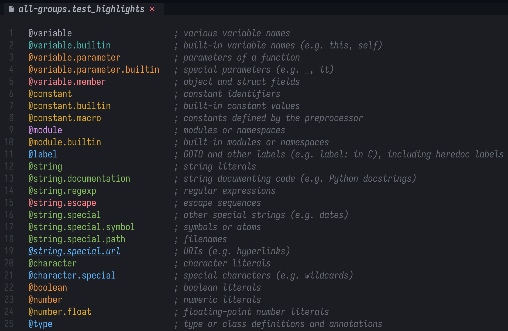

# Test Highlights grammar for Tree-Sitter

This repository provides a Test Highlights grammar for [tree-sitter](https://tree-sitter.github.io/tree-sitter/) and a Neovim plugin for easy installation.

It is useful for visualizing all pre-defined highlight groups in Neovim.

<p align="center">
  <a href="test-hl.png" target="_blank"></a>
</p>

## Installation

This particular configuration is for AstroNvim4,
but it should be similar for other Neovim setups that support Tree-Sitter.

When in doubt, refer to the [nvim-treesitter documentation](https://github.com/nvim-treesitter/nvim-treesitter#adding-custom-languages).

```lua
return {
  {
    "zebradil/tree-sitter-test_highlights",
    dependencies = { "nvim-treesitter/nvim-treesitter" },
    ft = { "test_highlights" },
  },
}
```

## Usage

After installing the plugin, you can open the [`all-groups.test_highlights`](./test/all-groups.test_highlights) file in Neovim to see all the highlight groups rendered with their respective styles.
