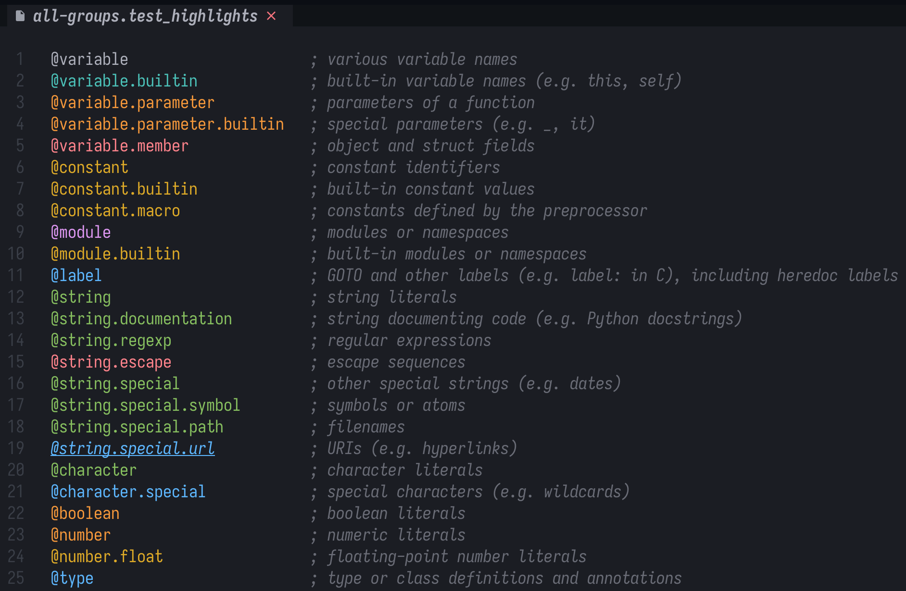

# Test Highlights grammar for Tree-Sitter

This repository provides a Test Highlights grammar for [tree-sitter](https://tree-sitter.github.io/tree-sitter/) and a Neovim plugin for easy installation.

It is useful for visualizing all pre-defined highlight groups in Neovim.

<p align="center">
  <a href="test-hl.png" target="_blank"></a>
</p>

## Installation

Using [lazy.nvim](https://github.com/folke/lazy.nvim):

```lua
{
  "zebradil/tree-sitter-test_highlights",
  dependencies = { "nvim-treesitter/nvim-treesitter" },
  ft = { "test_highlights" },
}
```

### Nix

**Step 1.** Add the flake input:

```nix
# flake.nix
{
  inputs.tree-sitter-test_highlights.url = "github:zebradil/tree-sitter-test_highlights";
}
```

**Step 2.** Apply the overlay:

```nix
nixpkgs.overlays = [
  inputs.tree-sitter-test_highlights.overlays.default
];
```

**Step 3.** Add the grammar and plugin to your Neovim configuration:

```nix
# Add to grammarPackages
pkgs.tree-sitter-test_highlights

# Add to extraPlugins
pkgs.vimPlugins.tree-sitter-test_highlights-nvim
```

## Usage

After installing the plugin, you can open the [`all-groups.test_highlights`](./test/all-groups.test_highlights) file in Neovim to see all the highlight groups rendered with their respective styles.
